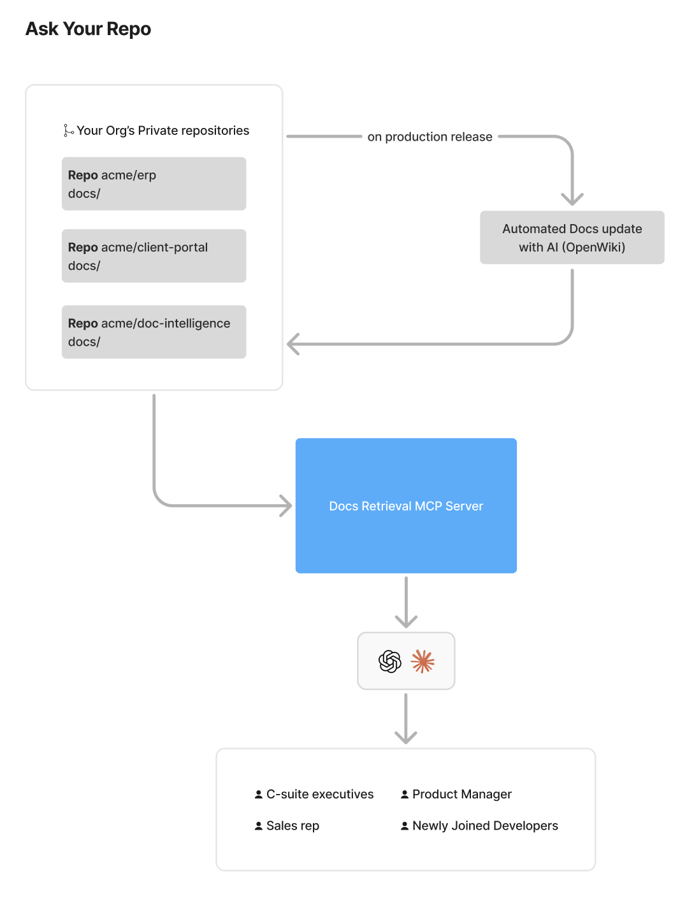

# ask-your-repo

MCP server for reading docs from your private GitHub repos.



The OpenWiki step (updating each repo's docs on production release) is set up separately; this repo is only the MCP server.

## Tools

- `list_repos` — private repos you can access
- `list_repo_contents` — markdown docs in a repo, with IDs
- `read_repo_file` — read a doc by ID

## Setup

Copy [`.env.example`](.env.example) to `.env` and fill it in.

Generate a client token and append its hash to `.env` (keep the printed token; it is not stored):

```
uv run python -c "import hashlib,secrets; t=secrets.token_urlsafe(32); open('.env','a').write(f'\nMCP_TOKEN_SHA256={hashlib.sha256(t.encode()).hexdigest()}\n'); print(t)"
```

## Run

```
uv run python main.py
```

Or with Docker:

```
docker build -t ask-your-repo .
docker run --env-file .env -p 8000:8000 ask-your-repo
```

## Connect

```
http://127.0.0.1:8000/mcp?token=<client token>
```

## Test

```
uv run python -m unittest
```

## Deployment

`.github/workflows/ci-cd.yml` runs tests on every PR. On push to `main` it builds and pushes
`mahantsolutions/global:ask-your-repo-<sha>`, then deploys over SSH to the `ask-your-repo-prod` droplet,
where `docker-compose.yml` runs the app behind Caddy (automatic HTTPS) at
`https://ask-any-repo.getcruisecontrol.com/mcp?token=<client token>`. A `v*` tag re-tags that commit's
image as `ask-your-repo-<tag>`.

Repository secrets: `DOCKER_USERNAME`, `DOCKER_PASSWORD`, `SSH_HOST`, `SSH_USER`, `SSH_PRIVATE_KEY`,
`SSH_KNOWN_HOSTS`, `APP_GITHUB_TOKEN` (becomes `GITHUB_TOKEN` in the app), `MCP_TOKEN_SHA256`, `SLACK_BOT_TOKEN`.
Optional repository variables: `DEFAULT_BRANCH`, `DOCS_FOLDER_PATH`, `MAX_FILE_TOKENS`.

Roll back by re-running an earlier successful run of the workflow from the Actions tab.
